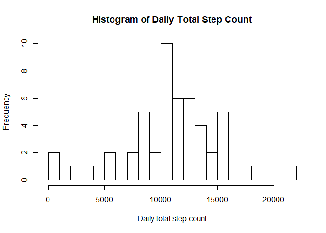
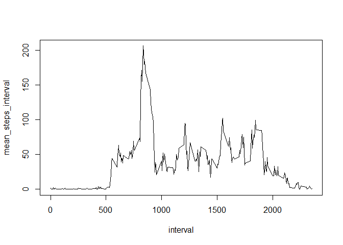
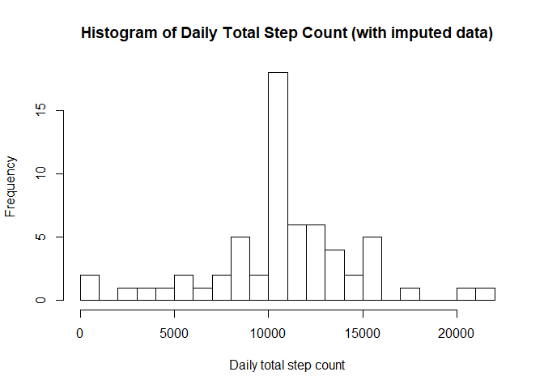
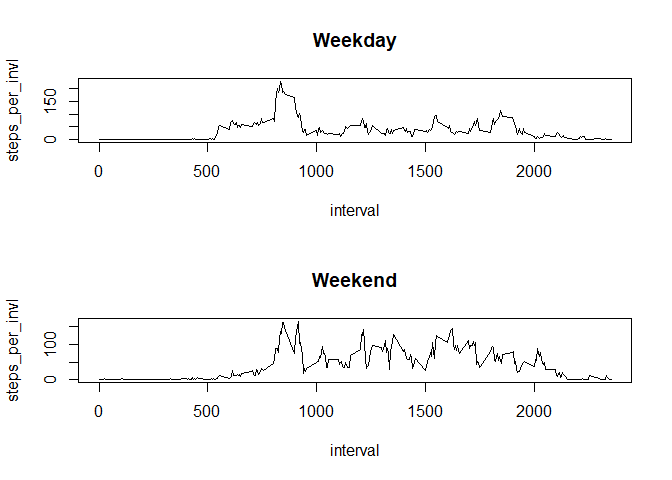

## Loading and Preprocessing the Data

Set the working directory, load in any relevant packages, and load in the data.


```r
library(dplyr)
```

```
## Warning: package 'dplyr' was built under R version 3.3.2
```

```
## 
## Attaching package: 'dplyr'
```

```
## The following objects are masked from 'package:stats':
## 
##     filter, lag
```

```
## The following objects are masked from 'package:base':
## 
##     intersect, setdiff, setequal, union
```

```r
library(xtable)
```

```
## Warning: package 'xtable' was built under R version 3.3.3
```

```r
setwd('C:/Users/jonny/Documents/Coursera')
dat <- read.csv('activity.csv')
```

Get the data ready for analysis by changing it to a data frame and grouping it by date (using the group_by() function from the dplyr package).

```r
dat_df <- data.frame(dat)
by_date <- group_by(dat_df,date)
```

## What is mean total number of steps taken per day?

We can take the total number of steps taken per day by using the sum() function, and setting na.rm to TRUE to ensure we ignore the missing values.


```r
print(sum(dat_df$steps, na.rm=TRUE))
```

```
## [1] 570608
```

Now we use the dataset grouped by date (i.e. by_date) to find the total number of steps taken on each day using the summarise() function from the dplyr package, and plot a histogram of this.  Note that we also remove any values which have not been recorded (i.e. are NAs)


```r
by_date <- by_date[!is.na(by_date$steps),]
by_date_sums <- summarise(by_date, steps_per_day = sum(steps, na.rm=TRUE))
hist(by_date_sums$steps_per_day, n = 20, xlab = 'Daily total step count', main = 'Histogram of Daily Total Step Count')
```

<!-- -->

We'll now use by_date_sums to calculate the mean and median numbers of steps per day.


```r
mean_steps <- mean(by_date_sums$steps_per_day)
print(mean_steps)
```

```
## [1] 10766.19
```

```r
median_steps <- median(by_date_sums$steps_per_day)
print(median_steps)
```

```
## [1] 10765
```


## What is average daily activity pattern?

This time, we group the data by the interval, and then use the summarise() function again to find the mean number of steps taken during those intervals (again, ignoring NA values).


```r
by_interval <- group_by(dat_df,interval)
by_interval_sums <- summarise(by_interval, mean_steps_interval = mean(steps, na.rm=TRUE))
with(by_interval_sums, plot(interval, mean_steps_interval, type="l"))
```

<!-- -->

After having already used the summarise() function, we can also find the interval in which the greatest number of steps were taken on average.  To do this, we index the Interval column of the by_interval_sums dataset by the maximum value found in the mean_steps_interval column, using which.max() to find this.


```r
by_interval_sums$interval[which.max(by_interval_sums$mean_steps_interval)]
```

```
## [1] 835
```

## Imputing missing values

Firstly, we should determine how many missing values there are in the dataset.  To do this, we can use the is.na() function to determine which entries contain an 'NA' value, and then use the sum() function to calculate how many of these there are.


```r
numMiss <- sum(is.na(dat_df$steps))
```

Now we need to determine what these entries could have been.  One option here is to use the average number of steps taken during that interval taken across the whole dataset.  We can use the 'by_interval_sums' dataset to do this.  Though we should round the data into integers (taking 0.17 of a step doesn't make much sense!)


```r
by_interval_sums$rounded_steps <- round(by_interval_sums$mean_steps_interval)
full_df <- dat_df
for (entry in 1:dim(full_df)[1]){
  if (is.na(full_df$steps[entry])) {
    interval_to_match <- full_df$interval[entry]
    mean_at_interval <- by_interval_sums$rounded_steps[by_interval_sums$interval==interval_to_match]
    full_df$steps[entry] <- mean_at_interval
  }
  else {
    full_df$steps[entry] <- full_df$steps[entry]
  }
}
```

We can now plot up a new histogram with this full dataset, and calculate the new mean and median total steps.  We can see there are some slight (but very small) differences between the actual and the imputed data.


```r
by_date_full <- group_by(full_df,date)
by_date_full_sums <- summarise(by_date_full, steps_per_day = sum(steps, na.rm=TRUE))
hist(by_date_full_sums$steps_per_day, n = 20, xlab = 'Daily total step count', main = 'Histogram of Daily Total Step Count (with imputed data)')
```

<!-- -->

```r
mean_steps_full <- mean(by_date_full_sums$steps_per_day)
print(mean_steps_full)
```

```
## [1] 10765.64
```

```r
print(mean_steps)
```

```
## [1] 10766.19
```

```r
difference_in_means <- abs(mean_steps_full-mean_steps)
print(difference_in_means)
```

```
## [1] 0.549335
```

```r
median_steps_full <- median(by_date_full_sums$steps_per_day)
print(median_steps_full)
```

```
## [1] 10762
```

```r
print(median_steps)
```

```
## [1] 10765
```

```r
difference_in_medians <- abs(median_steps_full-median_steps)
print(difference_in_medians)
```

```
## [1] 3
```


## Are there any differences in activity between weekdays and the weekend?

To determine whether there are differences in activity between weekdays and the weekend, we need to use the weekdays() function to figure out which day of the week each date is.  Firstly, we have to convert our 'date' factor into a 'Date' variable type.  We'll then create a new factor which defines whether or not the date falls on the weekend or a weekday.


```r
full_df$date <- as.Date(full_df$date,"%Y-%m-%d")
full_df$day <- weekdays(full_df$date)

full_df$dayType <- sapply(full_df$day,function(x) ifelse(x %in% c("Saturday", "Sunday"), "Weekend", "Weekday"))

full_df$dayType <- as.factor(full_df$dayType)
```

Now we can manipulate the data in the same way we have done previously, and create a time series plot to compare dataacross weekdays and weekends.


```r
weekend_df <- subset(full_df,dayType=="Weekend")
weekday_df <- subset(full_df,dayType=="Weekday")

weekend_df <- group_by(weekend_df,interval)
weekday_df <- group_by(weekday_df,interval)
weekend_sums <- summarise(weekend_df, steps_per_invl = mean(steps, na.rm=TRUE))
weekday_sums <- summarise(weekday_df, steps_per_invl = mean(steps, na.rm=TRUE))

par(mfrow=c(2,1))
with(weekday_sums, plot(interval, steps_per_invl, type="l", main="Weekday"))
with(weekend_sums, plot(interval, steps_per_invl, type="l", main="Weekend"))
```

<!-- -->
From the graphs above, we can see that step counts are fairly evenly distributed at the weekend.  During weekdays, however, there's a large spike at the start of the day (probably as people are commuting to work), and then much lower steps throughout the rest of the day - meaning we can probably assume a lot of the people in this study had desk jobs!
